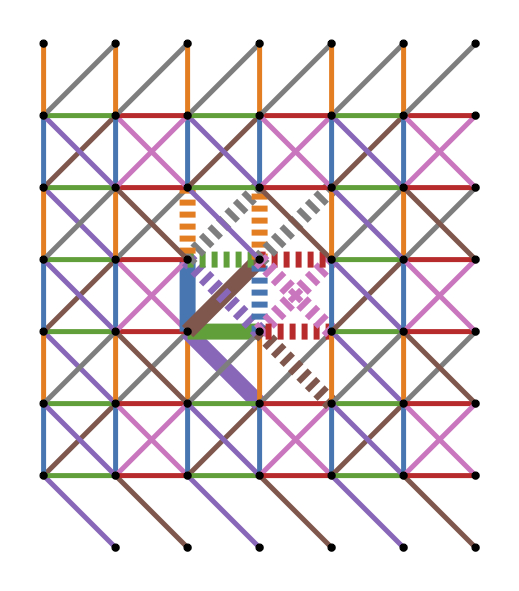

<h1>Edge coloring lattice graphs (ECoLPy)</h1>
Joris Kattemölle

This repository contains the code, data and images for the edge coloring of lattice graphs, as described in [arxiv:????](https://www.arxiv.org/????). 

# Usage
We introduce the usage by a simple example. (For installation, see [installation](#installation).) Let's say we want to find a minimal edge coloring of the square lattice graph, with edges to (geometrically) next-nearest neighbors added. This lattice graph is sometimes referred to as the diagonal lattice or the dense grid graph.

In all code below, we assume the working directory is the root directory of the repository. 

```python
# Define the basis graph by its edges.
# Vertices are written as `(x, y, s)`, with `x, y` the coordinate of the cell 
# the node is in, and `s` a unique identifier for the nodes in a cell. 

edges = [
    ((0, 0, 0), (1, -1, 0)),
    ((0, 0, 0), (1, 0, 0)),
    ((0, 0, 0), (1, 1, 0)),
    ((0, 0, 0), (0, 1, 0)),
]

# Construct a LatticeGraph instance.
import ecolpy as ep
lat = ep.LatticeGraph(edges, name="diagonal")

# Find a class I edge coloring of the lattice graph.
clat = lat.edge_color(1)

# Inspect the result.
print(clat.basis_graph.edges(data=True))

# Create and save a plot of the edge colored lattice graph in the workding directory.
ep.plot_edge_coloring(lat, clat, ".")
```
This prints

``` python
[((0, 0, 0), (1, -1, 0), {'color': 4}), ((0, 0, 0), (1, 1, 0), {'color': 5}), ((0, 0, 0), (1, 0, 0), {'color': 2}), ((0, 0, 0), (0, 1, 0), {'color': 0}), ((1, 1, 0), (2, 0, 0), {'color': 6}), ((1, 1, 0), (2, 2, 0), {'color': 7}), ((1, 1, 0), (1, 0, 0), {'color': 0}), ((1, 1, 0), (1, 2, 0), {'color': 1}), ((1, 1, 0), (0, 1, 0), {'color': 2}), ((1, 1, 0), (2, 1, 0), {'color': 3}), ((2, 0, 0), (1, 0, 0), {'color': 3}), ((1, 0, 0), (0, 1, 0), {'color': 4}), ((1, 0, 0), (2, -1, 0), {'color': 5}), ((1, 0, 0), (2, 1, 0), {'color': 6}), ((0, 1, 0), (0, 2, 0), {'color': 1}), ((0, 1, 0), (1, 2, 0), {'color': 7})]
```
and will save the following image under `diagonal.pdf`



The bold solid lines show the graph that needs to be repeated to construct the diagonal lattice graph. Bold lines (solid and dashed) show the edge colored pattern that needs to be repeated to edge color the entire diagonal lattice graph. 

The class I edge colorings of all lattice graphs mentioned in the paper were found and plotted by running 

```bash 
$ python3 edge_color_all.py
```

# Precomputed edge colorings
Images of precomputed edge colorings of, e.g., the Galebach collection, are stored in `colorings/galebach/`. 

Additionally, this folder contains `edge_colored_galebach.json`. It is of the following format

``` json
{
    "name" : 
        {
            "latbg" : ...,
            "clatbg" : ...,
            "patch_size" : ...,
            "coloring_class" : ...
            "wall_clock" : ...
        }
    ...
}
```
- `"name"` : The name of the lattice. In the case of the Galebach collection, this is equal to the name of the lattice in `galebach.json` as given by the authors of that `json` (see paper). That is, `"t<k><yyy>"` is the $k$-uniform lattice number `<yyy>` (according to some unknown ordering). The $k$-uniform, $k$-Archimedean lattices are named `"t<k>u<yyy>"`. The names in `edge_colored_saesa.json` are equal to the names given to the graphs in `saesa.json` by the authors of that `json` (see paper). The names of the lattices in `edge_colored_misc.json` are as in the paper. 

- `"latbg"` : The basis graph of the uncolored lattice graph ($B$ in the paper). The format of `latbg` is as of the output of `networkx.node_link_data(bg)` with `bg` the basis graph as a networkx graph. The graph `latbg` can be loaded as a networkx graph using `networkx.node_link_graph`.

- `"clatbg"` : The edge coloring basis graph of the colored lattice ($C$ in the paper), similar to `latbg`, but with colored edges. 

- `"patch_size"` : The size of the edge coloring basis graph in terms of uncolored basis graphs, denoted by $(n,m)$ in the paper.

- `"wall_clock"` : The wall clock time in seconds used to compute the minimal edge coloring `clatbg` from `latbg`. 

# How to load a precomputed edge coloring
To load the coloring basis graph of lattice `"t1001"` in `edge_colored_galebach.json`, run the following in python from the base directory of the repository.

``` python
import ecolpy as ep

clat = ep.LatticeGraph.from_edge_colored_json(
    "colorings/galebach/edge_colored_galebach.json", "t1001"
)

print(clat.basis_graph.edges(data=True))
```
which gives

``` python
[((0, 0, (0, 0, 0, 0)), (0, 0, (0, 0, 1, 0)), {'color': 0}), ((0, 0, (0, 0, 0, 0)), (-1, -1, (0, 0, 1, 0)), {'color': 1}), ((0, 0, (0, 0, 0, 0)), (0, -1, (0, 0, 1, 0)), {'color': 2})]
```

(Here, the "seed numbers" (third entry of a node like `(0, 0, (0, 0, 0, 0))` are not actually numbers but tuples, related to the 'tiling symbol' notation used in the uncolored json files. Above, the only function of the tuples is, just like the seed numbers, to distinguish the different nodes in one unit cell, and can be mapped to integers without problems if necessary.)

<h1 id="installation">Installation<h1>
## TL;DR 
If you have git and anconda/miniconda installed, in a terminal, run 

``` bash
git clone https://github.com/kattemolle/ecolpy.git 
cd ecolpy
conda env create --file environment.yml
conda activate ecolpy
```
After that, you should be able to run the example under 'usage'. 
## More info
Download and unpack the repository. Or, if you have git, run

``` bash
git clone https://github.com/kattemolle/ecolpy.git 

```
Our implementation is written in Python 3, relying on:

- networkx 
- z3-solver
- numpy
- graphviz
- pygraphviz

To install these programs and python packages, it is possibly easiest to install [anaconda](https://docs.anaconda.com/free/anaconda/install/mac-os/) or [miniconda](https://docs.conda.io/projects/miniconda/en/latest/miniconda-install.html). After that, in a terminal, change the directory to the base directory of the EColPy repository, and run

```bash
conda env create --file environment.yml
conda activate ecolpy
```

The installation may take a while. 

We recommend the use of `environment.yml`. The exact environment that was used to generate the data in the paper is found in `environment_exact.yml`. (This environment is more detailed, but may lead to portability issues.) 

Please feel free to contact me at `joris at kattemolle dot com`, or to open an issue, if you experience any issues with the installation or usage of EColPy. You can also contact me if you need some custom lattice graph to be edge colored, I can do it for you with little effort. 

# How to cite

``` bibtex
@misc{kattemolle2024edge,
      title={Edge coloring lattice graphs}, 
      author={Kattemölle, Joris},
      year={2024},
      eprint={????},
      archivePrefix={arXiv},
      primaryClass={cs.DM}
}
```
